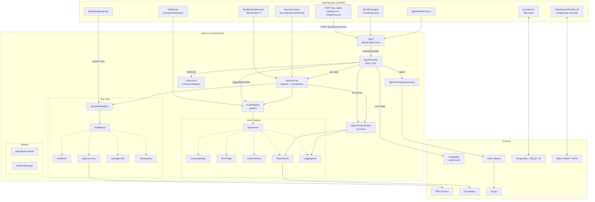
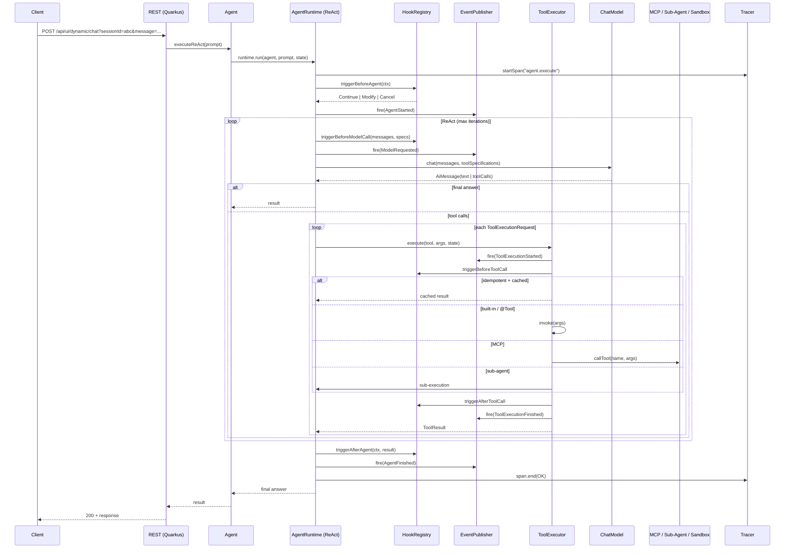

# quad Architecture

> Verified against the codebase on 2026-09-13.
> Dutch version history was consolidated into this single document: the former
> `ARCHITECTURE.md` (diagrams), `Architecture.md` (overview) and
> `ARCHITECTURE_DESIGN.md` (SoC analysis) were merged here and their
> implementation-progress / status content removed.

## 1. Overview

**quad** is an enterprise-grade **LLM agent orchestration framework** on
**Java 21**, built on **LangChain4j 1.15.0** and **Quarkus 3.33.2**. It is a
Java port of the NVIDIA Object-Oriented Agents (NOOA) approach — agents as
objects, methods as tools, generation methods for LLM-driven reasoning —
implemented with **typed Java Function Calling** and a **Bash sandbox**
fallback instead of a Python CodeAct REPL. The hook/interceptor pipeline is
inspired by **strands-agents**.

Core capabilities:

- **Hook-based pipeline** — ordered lifecycle hooks (`AgentHook`) around agent / model / tool execution
- **Tool & registry layer** — `QuadToolRegistry`, `ToolMethod` abstraction, built-in tools, MCP, sub-agents, sandbox
- **ReAct agent runtime** — reasoning + acting loop with OTel spans, events, structured-output forcing
- **Capability / skill discovery** — vector-indexed semantic search, markdown `SKILL.md` skills, runtime tool activation
- **Cross-cutting concerns** — guardrails, HITL checkpoints, GDPR/PII, resilience (retry/circuit-breaker), validation
- **Security** — OIDC, `SecurityContext`, tool RBAC (`ToolGuard`), token exchange (RFC 8693) for MCP, audit trail
- **Messaging & connectors** — Kafka, AMQP, e-mail channels plus a framework-agnostic connector registry
- **Workflow engine** — DAG workflows with fork/join, loops, conditionals, async nodes, nested workflows
- **Observability** — OpenTelemetry (traces) + Micrometer (metrics) + structured logging, provenance tracking

## 2. Module Structure

The Maven reactor declares **9 Java modules** plus one npm-based frontend:

| Module | Purpose | Key content | ~Files (main) |
|---|---|---|---|
| `quad-core` | Agent framework core | agent/agent runtime, hook pipeline, guardrails, HITL, GDPR, resilience, observability, capability/skills, sessions, tools, connectors, security, events, validation, scope | 225 |
| `quad-workflow-core` | Framework-agnostic workflow model | `core/workflow`, `workflow/schedule` (`CronExpression`, `Schedule`, `ScheduledTask`), `workflow/transfer` | 20 |
| `quad-tool-builtin` | Default tool set | `core/tool/builtin` (read/write/grep/web/bash sandbox client, patch tools) | 14 |
| `quad-tool-mcp` | MCP tool bridge | `core/tool` (`McpToolMethod`, MCP registry bindings) | 5 |
| `quad-search-elasticsearch` | Optional vector index | `core/capability/ElasticsearchCapabilityIndex` | 1 |
| `quad-search-pgvector` | Optional vector index | `core/capability/PgVectorCapabilityIndex` | 2 |
| `quad-sandbox-docker` | Docker sandbox execution | `core/tool/sandbox` (dev fallback) | 8 |
| `quad-quarkus` | Quarkus runtime + REST + workflow engine + persistence | `agent`, `automation`, `contract`, `guardrails`, `hitl`, `mcp`, `memory`, `messaging` (kafka/amqp/email), `permission`, `persistence`, `provenance`, `resilience`, `security`, `skillstore`, `tooling`, `ui`, `workflow`, `workspace` | 103 |
| `quad-examples` | Runnable demo applications | Research/workflow demos (40 files incl. tests) | 40 |

`quad-ui` is a separate **React 19 / TypeScript 6 / Vite 8** application
(`@xyflow/react` workflow canvas, `mermaid` diagrams, `react-router-dom`),
built via npm, not part of the Maven reactor.

**Dependency flow:** `quad-quarkus` → `quad-core` (+ tool/search/sandbox/`quad-workflow-core` modules) → LangChain4j. `quad-examples` → `quad-quarkus`. Searches, sandbox and MCP are optional drop-ins behind core interfaces.

## 3. Package Layout

### 3.1 quad-core (`de.augmentia.quad.core`)

```
agent/          Agent (abstract base), QuadAgent, AgentBuilder, AgentResult,
│               RunSnapshot, StopReason, ExecutionMetrics, HitlFacade, SessionFacade
├── channels/   Channel, QueueChannel, TimerChannel, ChannelManager
├── messaging/  InboundChannel, OutboundChannel, SyncChannel, QuadMessage
├── runtime/    AgentRuntime (ReAct loop), ToolExecutor, EventManager, SpanFactory,
│               IdempotencyStore, DynamicToolProvider
└── strategies/ PredictStrategy, ReflexionStrategy, TemplateStrategy
annotation/     @Tool, @Param, @Prompt, @Hidden, @Idempotent, @SagaAgent, @GenerationMethod, @ToolRole
capability/     Capability, CapabilityRegistry/Search, TenantContext, CapabilitySearch (vector index SPI)
├── context/    ContextManager, context blocks
├── doc/        AgentDocExtractor
├── prompt/     Prompt rendering/templates
└── skill/      Skill, SkillRegistry, SKILL.md parsing
config/         QuadConfig, ModelFactory, LlmConfig, ModelProvider, RetryingChatModel
connectors/     Connector, ConnectorRegistry, OutboundMessaging, OutboundSender, MessageTarget (framework-agnostic outbound layer)
events/         sealed AgentEvent hierarchy (AgentStarted, BeforeInvocation, ModelRequested,
                ToolExecutionStarted/Finished, AfterInvocation, AgentFinished, Token,
                AgentStateChanged, ToolSetChanged) + AgentEventListener
gdpr/           GdprAgentPlugin, PiiAnonymizerHook, PiiRedactionHook, AuditTrailHook, GdprExport/DeleteTool
guardrails/     Guardrail, GuardrailPlugin, GuardrailResult, BlockAction, GuardrailException, ApprovalResult
guards/         TextOnlyGuard
hitl/           HITLPlugin, HITLProvider, HITLAuthority
└── checkpoint/ CheckpointService, CheckpointStore
hook/           AgentHook, HookRegistry, HookResult, HookContexts, HookFailurePolicy, HookProvider
└── plugin/     Plugin, PluginRegistry, agent skill plugin, SkillActivationHook
message/        minimal message wrapper types
observability/  MetricsHook, TracingHook, LoggingHook, EventFilters, LoggingChatModel,
│               FileLlmLogger, AgentMetrics, AgentTracing
└── provenance/ ProvenanceTracker (+ ProvenanceEntry) implementing AgentEventListener
patterns/       planner patterns (Desire, VotingStrategy, ConflictResolutionStrategy)
resilience/     Retry, CircuitBreaker, TokenRecovery (config classes)
scope/          AgentScope, TypedStateKey, FieldExtractor (session-scoped typed state)
security/       SecurityContext, SecurityConfig, SecretsProvider, TokenExchangeClient,
│               TokenExchangeConfig, ToolGuard, AuditEvent
session/        AgentSessionState, SessionManager
├── memory/     memory managers (PersistentMemoryStore SPI)
├── query/      query abstractions
├── saga/       SagaAgent, CompensatingAction, SagaAuditRecord
└── store/      session/event stores
tool/           QuadToolRegistry, ToolMethod, ReflectiveToolMethod, ToolArgsMapper,
│               ToolSpecificationBuilder, DynamicSubAgentTool, SubAgentTool, StandardToolProvider,
│               SkillSearchTool, CapabilitySearchTool, ToolActivatorTool, Gizmo* , BaseToolNames
├── builtin/    (see quad-tool-builtin drop-in; kept minimal here)
├── prefill/    InspectInputsPrefill
└── sandbox/    (see quad-sandbox-docker drop-in; SPI kept here)
validation/     StructuredOutputValidator
```

> Note: `tool/builtin` and `tool/sandbox` exist as small home-spots in
> `quad-core`; the actual implementations live in the dedicated modules and are
> wired via the `BuiltInToolProvider` / `SandboxClient` SPIs.

### 3.2 quad-quarkus (`de.augmentia.quad.quarkus`)

```
agent/            AgentBuilderFactory, TieredChatModel, QuarkusAgentRuntime, config/, hook/, runtime/
automation/       AutomationStore/Service, AutomationTaskRunner, TaskRun, SchedulerService
contract/         ApiDtos, StepRecord (shared API DTOs)
guardrails/       GuardrailFactory
hitl/             HitlService, CheckpointResource, SSEChannel
mcp/              McpManagerService
memory/           JdbcMemoryStore, MemoryResource
messaging/        MessagingRouter, MessagingProcessor, ChannelAgentFactory, TopicAgentMapping
├── kafka/        KafkaInboundChannel, KafkaOutboundChannel, KafkaHitlSender
├── amqp/         AmqpInboundChannel, AmqpOutboundChannel
└── email/        EmailInboundChannel, EmailOutboundChannel
permission/       PermissionService, SessionPermissionRegistry, PermissionGuardHook, PermissionResource
persistence/      SessionStore, RunStore, TelemetryStore, StepSnapshotStore, JournalService,
│                 AgentStepExporter, SqlDialect
provenance/       ProvenanceResource
resilience/       ResilientToolExecutor (MicroProfile Fault Tolerance)
security/         QuarkusSecurityContext, DbAuditLogger, QuarkusAuditLogger, AuditResource,
│                 JsonlFileWriter, SecurityEnforcementFilter, CorrelationFilter
skillstore/       JdbcSkillStore, SkillsConfig, SkillResource
tooling/          SandboxClientProducer
ui/               UiAppResource, SystemController, AgentController, ObservabilityController,
│                 SharedState, AgentBean, DemoAgent, UiConfig, PersistenceStore, WorkflowTransferService
└── alias/        UiPermissionAlias, UiProvenanceAlias, UiWorkspaceAlias, UiAutomationAlias
workflow/         WorkflowGeneratorService, DynamicWorkflowResource, WorkflowCondition
├── engine/       WorkflowEngine, WorkflowScheduler
├── node/         NodeExecutor, NodeExecutorRegistry, NodeRunner, NodeConfig
│   └── executor/ Agent, Async, Conditional, Fork, Join, Loop, NestedWorkflow
├── context/      JsonPathResolver, InputBuilder
└── internal/     GraphUtils, RunStateWriter, WorkflowExecutionContext, WorkflowSupport
workspace/        WorkspaceService, WorkspaceStore, WorkspaceRecord, WorkspaceResource
```

### 3.3 Optional drop-in modules

```
quad-workflow-core/   de.augmentia.quad.core.workflow{,.schedule,.transfer} — workflow model + cron scheduling
quad-tool-builtin/    de.augmentia.quad.core.tool.builtin — default tool implementations
quad-tool-mcp/        de.augmentia.quad.core.tool — MCP client tool bridge
quad-search-elasticsearch/  de.augmentia.quad.core.capability — Elasticsearch vector index
quad-search-pgvector/       de.augmentia.quad.core.capability — Postgres pgvector index
quad-sandbox-docker/        de.augmentia.quad.core.tool.sandbox — Docker sandbox (dev)
```

These modules mirror the interfaces kept in `quad-core` and can be swapped per
deployment (e.g. pgvector vs. Elasticsearch).

## 4. Component Overview



## 5. Request Data Flow



## 6. Hook Pipeline & Cross-Cutting Concerns

Hooks form an ordered `HookRegistry` chain (`AgentHook` SPI, `HookResult` =
Continue/Modify/Cancel/Retry, `HookFailurePolicy` = ISOLATE/CHAIN_ABORT).
Features are implemented as hooks/plugins or event listeners and are **not**
part of the interception core:

| Concern | Mechanism | Implementation |
|---|---|---|
| Guardrails | `GuardrailPlugin` (hook) | input/output validation, PII detection, block actions |
| HITL | `HITLPlugin` + `HitlService` | checkpoints, approvals, `CheckpointResource` |
| GDPR/PII | hooks + tools | `PiiAnonymizerHook`, `PiiRedactionHook`, `AuditTrailHook`, export/delete tools |
| Resilience | `ResilientToolExecutor` (quarkus) | `@Retry`, `@CircuitBreaker`, `TokenRecovery` |
| Observability | event listeners / hooks | `MetricsHook`, `TracingHook`, `LoggingHook`, `AgentTracing`, `ProvenanceTracker` |
| Security | context + guards | `SecurityContext`, `ToolGuard`, `SecretsProvider`, token exchange for MCP |
| Validation | static utility | `StructuredOutputValidator` |

## 7. Workflow Engine

The workflow engine lives in `quad-quarkus/workflow` and ships with these node
executors:

| Executor | Role |
|---|---|
| `AgentNodeExecutor` | runs an agent node |
| `AsyncNodeExecutor` | fire-and-forget / deferred completion |
| `ConditionalNodeExecutor` | branch / conditional edge |
| `ForkNodeExecutor` / `JoinNodeExecutor` | parallel fan-out/fan-in |
| `LoopNodeExecutor` | iteration with exit condition |
| `NestedWorkflowNodeExecutor` | embed a sub-workflow |

The engine (`WorkflowEngine`, `WorkflowScheduler`, `NodeExecutorRegistry`)
orchestrates nodes over a DAG (`DagModel` in `quad-workflow-core`), supports
state persistence per step (`persistence/RunStore`, `StepSnapshotStore`) and
exposes CRUD + execution via `DynamicWorkflowResource` and the UI.
`NodeExecutorRegistry` discovers executors via CDI.

## 8. REST API Surface

Class-level base paths currently mapped in `quad-quarkus`:

| Base path | Resource | Highlights |
|---|---|---|
| `/api` | `ObservabilityController` | `GET /health`, metrics, hooks, mcp status, model tiers, journal |
| `/ui` | `UiAppResource` | bundled SPA / UI serving |
| `/api/ui` | `SystemController`, `AgentController` | agents CRUD (+ duplicate), skills, guardrails, hooks, metrics, workflows CRUD/execute/runs, sessions, gdpr export/delete, messaging status |
| `/api/ui/dynamic` | `DynamicWorkflowResource` | chat (`/chat`, `/chat/start`, `/chat/sessions`), dynamic workflow generation/save/execute |
| `/api/ui/workspace\|permission\|provenance\|automation\|memory` | UI alias + domain resources | scoped frontend access |
| `/api/checkpoints` | `CheckpointResource` | HITL approvals (also exposes `/hitl/approvals...`) |
| `/api/automation` | `AutomationResource` | scheduled tasks, runs |
| `/api/skills` | `SkillResource` | skill CRUD |
| `/api/audit` | `AuditResource` | audit trail |
| `/api/permission`, `/api/provenance`, `/api/workspace`, `/api/memory` | domain resources | permission/provenance/workspace/memory management |

> The chat endpoint is served under `/api/ui/dynamic/chat` (session-oriented);
> older docs referenced a top-level `/api/chat` that no longer exists.

## 9. Messaging & Connectors

- **Channels (quarkus):** Apache Kafka (`KafkaInboundChannel`, `KafkaOutboundChannel`, `KafkaHitlSender`), AMQP, SMTP — guarded by `quad.messaging.*` config and `@IfBuildProperty` flags.
- **Core connectors (framework-agnostic):** `connectors/ConnectorRegistry`, `OutboundMessaging`, `OutboundSender`, `MessageTarget`, `BaseConnector`, `EventType` — outbound notifications decoupled from the transport.
- **Agent channels (core):** `Channel`, `QueueChannel`, `TimerChannel`, `ChannelManager` — async notifications injected as system messages.

## 10. Persistence & Deployment

- **Persistence:** `quad-quarkus/persistence` + `memory`/`skillstore` JDBC stores. Profiles select the DB: PostgreSQL (+pgvector) for prod (via `QUARKUS_DATASOURCE_*` env), SQLite for dev and cloud by default; Flyway migrations (`migrate-at-start`, locations `db/migration/common` + per-kind) in `quad-quarkus/src/main/resources/db/migration`.
- **Runtime:** Quarkus REST / SSE (`/ui/*` SSChannel), OIDC via Keycloak, OpenTelemetry to OTel Collector, Micrometer to Prometheus.
- **Infrastructure:** layered `deploy/*.yml` Docker Compose stacks orchestrated by `./stack.sh` (infra → keycloak → mcp → app → frontend/observability). GKE via `deploy/helm/quad`; Cloud Run via `scripts/deploy.sh --target cloudrun`. Build via `scripts/build.sh` (dev/prod/cloud, `--native`).

## 11. Design Principles

1. **Composition over inheritance** — cross-cutting concerns are composed through the ordered hook chain, not subclassing
2. **Framework-agnostic core with optional drop-ins** — `quad-core` speaks CDI/SPI only; transports (MCP, search indexes, sandbox) are pluggable modules
3. **Markdown-driven skills** — declarative `SKILL.md` files enable non-developer contributions
4. **Hybrid DI** — Jakarta CDI for Quarkus deployment, programmatic `AgentBuilder` for pure-Java usage
5. **Deep LangChain4j coupling** — all LLM I/O goes through `ChatModel`/`ToolSpecification`/`AiMessage` abstractions
6. **Typed tools & structured output** — Java Function Calling + `StructuredOutputValidator` instead of a REPL

## 12. Open Points

Outstanding architectural items to (re-)evaluate:

1. **`AgentRuntime.java` is still large (~450 LOC)** — the ReAct loop, hook triggers, OTel span management, events and structured-output forcing remain concentrated; a `SpanFactory`/`OutputForcer` style extraction is only partially done.
2. **Workflow executor parity** — the engine currently provides 7 node executors; earlier design documents listed 13 (incl. `Compensate`, `Hitl`, `Messaging`, `Orchestrator`, `SubWorkflow`, `Transform`). Decide which are intentionally dropped vs. still needed.
3. **SPEC / code drift** — `docs/SPEC.md` still describes a planned layout (`quad-sandbox/`, `quad-tracing/`, build-time Gizmo invoker generation) that differs from the realized multi-module structure; the spec needs a reconciliation pass against the current reactor.
4. **UI spec is aspirational** — `docs/UI-Spec.md` describes a full "QUAD Studio" (dashboard, security center, monitoring, workflow composer); the current `quad-ui` implements a subset, and libraries such as TanStack Query / Recharts / a state store are not (yet) in use.
5. **Search parity** — `quad-search-pgvector` and `quad-search-elasticsearch` both exist as single-class modules; keep them optional and documented (no HNSW/Qdrant module yet).
6. **API surface growth** — the REST surface (permission, provenance, automation, messaging, MCP status, model tiers, journal) has outgrown the old docs; maintain it from `contract/ApiDtos`.
7. **Cloud deployment naming** — GCP/Helm docs refer to `quad-frontend`; confirm Cloud Run service and Helm chart names match `deploy/*.yml` / `values.yaml` consistently.